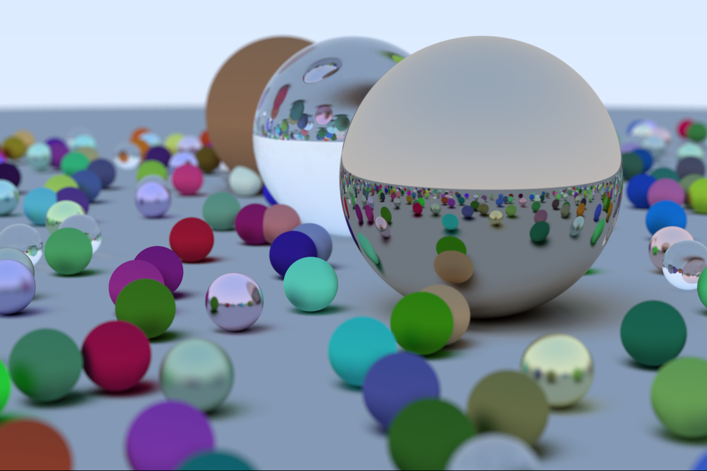

# Intro

This solution contains the C# version of the [first weekend](https://raytracing.github.io/books/RayTracingInOneWeekend.html) of the Raytracing in one weekend series.

The current state being generated is,

# Building

## Windows

It makes use of Visual Studio 2022,  as it already takes advantage of C# 10.

## macOS and Linux

Just use `dotnet build` as usual.
